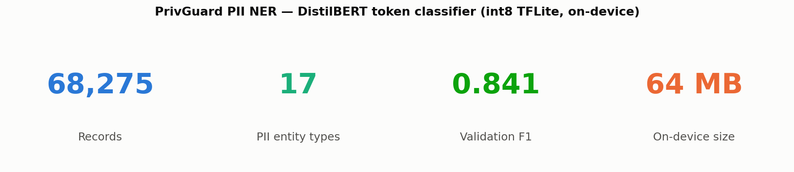
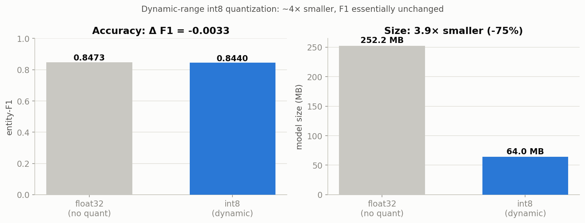
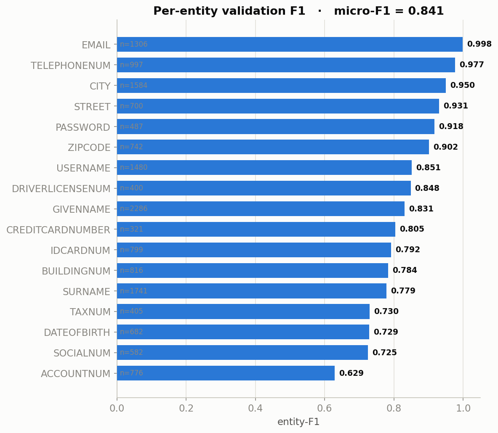

# PrivGuard

PrivGuard is a **Flutter-based privacy protection mobile application** that uses **on-device AI inferences** to helps users detect oversharing risks and sensitive information in their digital content including texts and images, along with **secore local data storage**.

### Applications

> Over 90% of digital threats begin with publicly available data.

PrivGuard educates and protects users by identifying:
- Posts that reveal personal details
- Real-time travel or location risks
- Information linked to password recovery
- IDs, documents, tickets captured in photos

---

## Core Features

### Upload & Local Scan
- Capture or upload media/text posts
- Securly save to local storage
- Long-press to run on-device scan

### AI Privacy Analysis
- **Text classifier**: NER-based risk labeling with DistilBERT
- **Risk Score**: 0–100 with Low, Medium, High tag
- **Smart Tips**: Context-aware advice (e.g., mask phone numbers, generalise location)
- **Image Scanning**: Object detection to extract and detect any risky details from image post

### Social Profile Risk Scanner (AVAILABLE IN FUTURE VERSIONS)
- Input Social Media handles like Instagram/Twitter
- Uses `Instaloader` / `snscrape` to fetch data
- NLP analysis of bio, captions, hashtags
- Auto-rescan every 30 days with push alerts

---

## Tech Stack

| Feature | Stack |
|---------|-------|
| Upload UI + Gallery | `Flutter`, `path_provider`, `image_picker` |
| AI Risk Detection | `DistilBERT`, `tflite_flutter`,`HuggingFace Transformers` |
| Security | `flutter_secure_storage`, `encrypt` |

---

## Custom AI Module

- Fine-tuned **DistilBERT** (`distilbert-base-uncased`) for token-level detection of Personally Identifiable Information in text.
- Trained on the English split of [`ai4privacy/pii-masking-400k`](https://huggingface.co/datasets/ai4privacy/pii-masking-400k) and exported to **int8 dynamic-range TFLite** so all inference runs **on-device**.
- Covers **17 PII entity types** (35 BIO labels), including:
  1. Names — given name, surname, username
  2. Address details — city, street, building number, ZIP code
  3. Phone numbers, email addresses, date of birth
  4. Financial / ID numbers — credit card, bank account, tax, social, driver's licence, ID card
  5. Passwords
- The training + export pipeline lives in [`ner model/pii_ner_colab.ipynb`](./ner%20model/pii_ner_colab.ipynb), which produces the four asset files the app loads: `pii_model.tflite`, `vocab.txt`, `tokenizer.json`, `tokenizer_config.json`.

---

## Model Performance

Trained on the English split (**68,275 records**) of `ai4privacy/pii-masking-400k`, the
model reaches **0.841 entity-level micro-F1** on a held-out validation set. The
figures below are generated by the final cell of the training notebook.

### Before vs. after compression

Dynamic-range **int8 quantization shrinks the model ~4× (252 MB → 64 MB)** with a
negligible accuracy change (**ΔF1 = −0.003**), which is why the quantized model is
the one shipped on-device.

### Per-entity accuracy

Structured, high-signal types (email, phone, city) score highest; free-form numeric
IDs (account number, social number) remain the hardest and are the main targets for
future data/labelling work.

> Figures live in [`images/`](./images/) and are regenerated by re-running the
> notebook's figures cell.

---

## App Screens (UI Flow)

1. **Gallery Screen**
   - Grid view of all uploaded content
   - Scan option on long-press

2. **Scan Result Screen**
   - Risk tag + reason: `"Passport detected"` or `"Location inferred"`
   - Actionable suggestions

3. **Social Media Scanner**
   - Input handle + email
   - View/email detailed report
   - Enable auto-scan mode

---

## Data Privacy & Ethics

- All analysis is performed **locally**
- No 3rd-party cloud APIs (e.g., Google Vision, Gemini)
- All posts, media files stored securly in local storage

---

## Getting Started

To Run the application locally-
1. This repo uses Git LFS to store large model files. Before cloning, install Git LFS  
    `git lfs install`.
2. Clone the repository 
     
    `git clone https://github.com/Shaurya-Saini/Priv_Guard.git` 
    `cd Priv_Guard` 
    `git lfs pull`
4. Create project
     
    `flutter create .`
3. Run the application using an emulator from Android studio  
    `flutter run`

 
